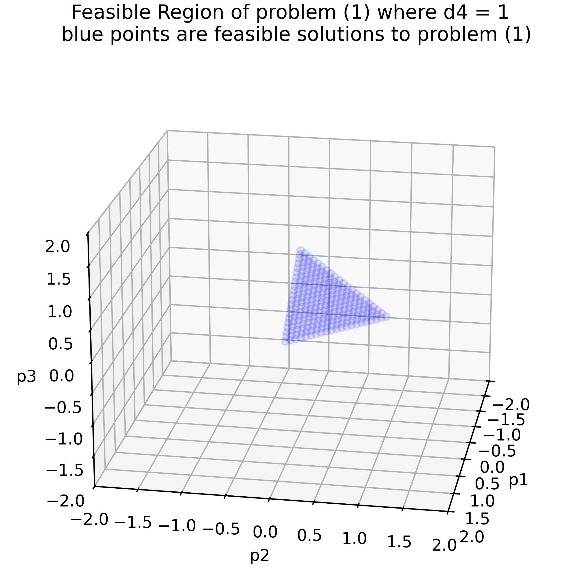
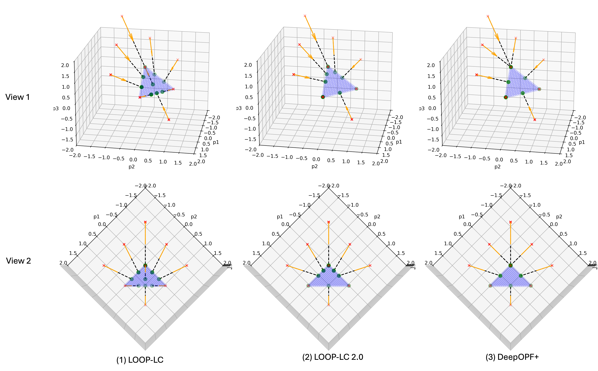
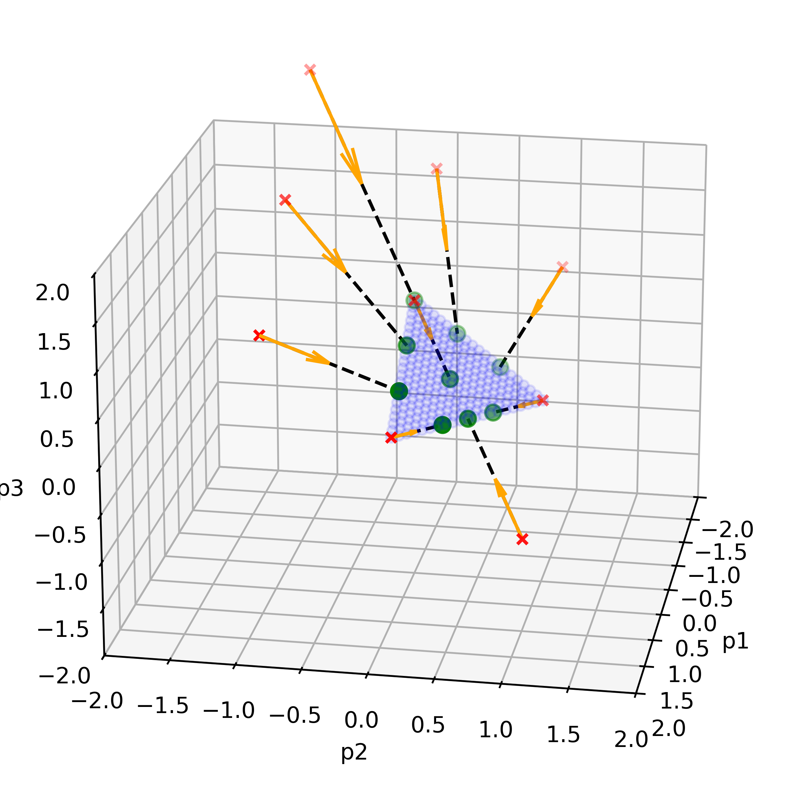
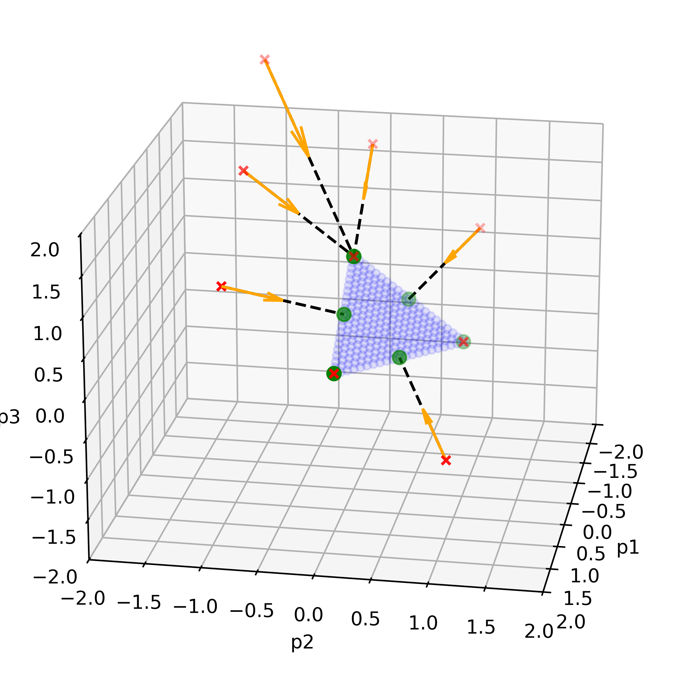

# Feasibility Achievement in Optimization Proxies

## Introduction

The integration of machine learning (ML) into optimization aims to enhance the efficiency of traditional iterative solvers. A significant challenge in deploying ML models for real-world problems lies in ensuring **feasibility**, i.e., adherence to physical and engineering constraints.

Extensive research has been conducted on developing ML optimization proxies that ensure feasible decision-making. A commonly used approach is adding penalty terms to minimize constraint violations. While effective across various optimization problems, this approach does not eliminate violations entirely (soft feasibility). To achieve **hard feasibility**, some methods incorporate repair modules that adjust solutions using iterative algorithms or explicit mapping functions to enforce constraint satisfaction directly.

This repository illustrates and compares different repair mechanisms, including **LOOP-LC** [1], **LOOP-LC 2.0**[2], and **DeepOPF+**[3], with a focus on their feasibility achievement methods. Instead of focusing on accuracy, we highlight the intuition and implementation of each approach to restore feasibility.

[1] Li, Meiyi, Soheil Kolouri, and Javad Mohammadi. "Learning to solve optimization problems with hard linear constraints." IEEE Access 11 (2023): 59995-60004.

[2] Li, Meiyi, and Javad Mohammadi. "Toward rapid, optimal, and feasible power dispatch through generalized neural mapping." 2024 IEEE Power & Energy Society General Meeting (PESGM). IEEE, 2024.

[3] Zhao, Tianyu, et al. "DeepOPF+: A deep neural network approach for DC optimal power flow for ensuring feasibility." 2020 IEEE International Conference on Communications, Control, and Computing Technologies for Smart Grids (SmartGridComm). IEEE, 2020.

---

## Optimization Problem

We consider a simple optimization problem:

**Objective:**
$$\text{minimize } f(p_1, p_2, p_3) \text{ (1a)}$$

**Subject to:**

  $$0 \leq p_1 \leq 1 \text{ (1b)}$$
  $$0 \leq p_2 \leq 1 \text{ (1c)}$$
  $$0 \leq p_3 \leq 1 \text{ (1d)}$$
  $$-1 \leq p_1 + p_2 \leq 1 \text{ (1e)}$$
  $$p_1 + p_2 + p_3 = d_4 \text{ (1f)}$$

Here:
- $d_4$ is an input parameter.
- $p_1, p_2, p_3$ are the optimization variables.

Traditional neural networks cannot guarantee the feasibility of constraints (1b)-(1f). A **repair layer** is introduced to transform neural network outputs into feasible solutions.

**Pipeline:**
$$d_4 \rightarrow \text{Neural Network (NN)} \rightarrow \hat{p_i} \rightarrow \text{Repair Layer} \rightarrow \tilde{p_i}$$

Where:
- $\hat{p_i}$: NN predictions before the repair layer.
- $\tilde{p_i}$: Feasible outputs after the repair layer.

---

## Feasible Range

To have a better understanding of the feasible range of problem (1), we start with a concept called **variable elimination**. Equality constraint (1f) relates $p_1, p_2, p_3$ such that:
$$p_3 = d_4 - p_1 - p_2$$

This reduces the problem to two independent variables ($p_1,p_2$):

**Reformulated Problem:**

**Objective:**
$$\text{minimize } f(p_1, p_2, d_4 - p_1 - p_2) \text{ (2a)}$$

**Subject to:**

$$0 \leq p_1 \leq 1 \text{ (2b)}$$

$$0 \leq p_2 \leq 1 \text{ (2c)}$$

$$0 \leq d_4 - p_1 - p_2 \leq 1 \text{ (2d)}$$

$$-1 \leq p_1 + p_2 \leq 1 \text{ (2e)}$$

This reformulation reveals that the problem involves a 2D feasible range within a 3D space.

### Visualization

The figure below illustrates the feasible range of constraints (1b)-(1f), where:
- **Blue points** represent all feasible solutions.
- Feasible solutions lie on a 2D plane within the 3D space.



---

## Comparison of Methods

### Overview of Repair Methods

1. **LOOP-LC (Learning to Optimize with Linear Constraints):**
   - The NN predicts independent variables (\(\hat{p_1}\), \(\hat{p_2}\)) within box constraints($-1\leq \hat{p_1}\leq 1,-1\leq \hat{p_2}\leq 1$).
   - A **gauge map** ensures a one-to-one mapping between the box range and the feasible range.
   - The repair layer maps predictions to feasible solutions ($\tilde{p_1}, \tilde{p_2}, \tilde{p_3}$).

2. **LOOP-LC 2.0:**
   - The NN predicts unconstrained variables ($\hat{p_1}, \hat{p_2} \in \mathbb{R}$).
   - Feasible predictions are retained. For infeasible predictions, a **generalized gauge map** rescales them to the boundary.

3. **DeepOPF+:**
   - The NN predicts full-size variables ($\hat{p_1}, \hat{p_2}, \hat{p_3}$).
   - Feasible predictions are retained. For infeasible predictions, an **iterative solver** projects them onto the feasible boundary by finding the closest point.

### Visual Comparison

The figure below compares predictions before and after repair for each method (\(d_4 = 1\)):
- **Red points:** NN predictions before repair.
- **Green points:** Predictions after repair.
- **Blue points:** Feasible solutions.



---

### Summary of Differences

| Model       | Hard Feasibility | Layer Type    | Differentiable | Iterations | Intuition                                                                                       |
|-------------|------------------|---------------|----------------|------------|-------------------------------------------------------------------------------------------------|
| LOOP-LC     | Yes              | Explicit      | Yes            | No         | NN predictions are mapped to feasible points using a gauge map for one-to-one mapping.         |
| LOOP-LC 2.0 | Yes              | Explicit      | Yes            | No         | Feasible predictions are retained; infeasible ones are rescaled to the boundary using a generalized gauge map. |
| DeepOPF+      | Yes              | Implicit      | No             | Yes        | Feasible predictions are retained; infeasible ones are projected onto the feasible boundary using iterative solvers. |

---

### Key Takeaways

- **LOOP-LC** uses a one-to-one mapping to ensure feasibility for all NN predictions.
- **LOOP-LC 2.0** rescales infeasible predictions to the boundary while retaining feasible ones.
- **DeepOPF+** iteratively projects infeasible predictions to the closest feasible points.


Below is appendix and code part.

## Code
### LOOP-LC

This is code to achieve feasibility repairment in LOOP-LC model

```python
def LOOP(hat_p1, hat_p2,hat_p3=0,d4=1):
  # This function achieve feasibility repairment in LOOP-LC model
  # input:  NN's predictions hat_p1, hat_p2, (hat_p3,d4)
  # output: model's predictions tilde_p1, tilde_p2, tilde_p3, satisfying (1b)-(1f)

  # LOOP-LC require an interior point to search for optimal solution
  interior_p1= d4/3
  interior_p2= d4/3
  interior_p3= d4/3


  # phy_b= max(abs(hat_p1),abs(hat_p2))
  phy_b= np.maximum(np.abs(hat_p1),np.abs(hat_p2))
  # print("phy_b",phy_b)
  # print(phy_b.shape)
  v1=hat_p1/(-interior_p1+1)
  v2=-hat_p1/(interior_p1)
  v3=hat_p2/(-interior_p2+1)
  v4=-hat_p2/(interior_p2)
  v5=(-hat_p1-hat_p2)/(-d4+interior_p1+interior_p2+1)
  v6=(hat_p1+hat_p2)/(d4-interior_p1-interior_p2)
  v7=(hat_p1+hat_p2)/(1-interior_p1-interior_p2)
  v8=(-hat_p1-hat_p2)/(1+interior_p1+interior_p2)

  # v1~v8 are with shape (n,), for each row index, find its maximun value among v1~v8 and form phy_s, phy_s is with shape (n,)
  # v1~v8 can be calculated through matrix operation to accerlerate computation
  phy_s= np.maximum(np.maximum(np.maximum(np.maximum(np.maximum(np.maximum(v1,v2),v3),v4),v5),v6),np.maximum(v7,v8))
  # print("phy_s",phy_s)
  # print(phy_s.shape)
  # scale =phy_b/phy_s, to improve accuracy, we use float
  scale=np.float64(phy_b/(phy_s+0.0000001))
  # print(scale.shape)
  tilde_p1=hat_p1*scale+interior_p1
  tilde_p2=hat_p2*scale+interior_p2
  tilde_p3=d4-tilde_p1-tilde_p2
  return tilde_p1, tilde_p2, tilde_p3
```

We use evenly distributed points within the cube [-1, 1] x [-1, 1](x [-1, 1]) to show all possible output of neural network(before repair) and apply LOOP-LC method.


```python
# Generating evenly distributed points as (hat_p1, hat_p2) within the cube [-1, 1] x [-1, 1]
x = y = np.arange(-1, 1.01, 1)
p1, p2 = np.meshgrid(x, y, indexing='ij')
# Flatten the grids into arrays of coordinates
hat_p1, hat_p2 = p1.flatten(), p2.flatten()
hat_p3=1-hat_p1- hat_p2 # assume some value of hat_p3 to plot, but LOOP does not use this information
nn_predictions = np.vstack((hat_p1, hat_p2, hat_p3)).T
# apply LOOP method
# for each point in hat_p1, hat_p2, use function LOOP to get tilde_p1, tilde_p2, tilde_p3
tilde_p1, tilde_p2, tilde_p3 = LOOP(hat_p1, hat_p2)
LOOP_predictions = np.vstack((tilde_p1, tilde_p2, tilde_p3)).T
```

And we plot the points before and after repairment:

```python
model_predictions = LOOP_predictions
# Adjust the figure size for better fit and visibility
fig = plt.figure(figsize=(5, 5))
ax = fig.add_subplot(111, projection='3d')
# Plotting points that are within the feasible range with transparency
ax.scatter(filtered_points[:, 0], filtered_points[:, 1], filtered_points[:, 2], color='blue', alpha=0.1)
# Plotting nn_predictions color is red use mark x
ax.scatter(nn_predictions[:, 0], nn_predictions[:, 1], nn_predictions[:, 2], color='red', marker='x')
# Plotting model_predictions color is green use mark o,size is 50
ax.scatter(model_predictions[:, 0], model_predictions[:, 1], model_predictions[:, 2], color='green', marker='o', s=50)
# add  lines with arrows for each pair (nn_prediction,model_prediction), arrow is from nn_prediction to model_prediction, connection nn_prediction and model_prediction
for i in range(len(nn_predictions)):
    ax.plot([nn_predictions[i, 0], model_predictions[i, 0]], [nn_predictions[i, 1], model_predictions[i, 1]], [nn_predictions[i, 2], model_predictions[i, 2]],
            color='black', linestyle='--')
    ax.quiver(nn_predictions[i, 0], nn_predictions[i, 1], nn_predictions[i, 2],model_predictions[i, 0] - nn_predictions[i, 0],
              model_predictions[i, 1] - nn_predictions[i, 1], model_predictions[i, 2] - nn_predictions[i,2], color='orange', length=0.5)

ax.set_xlabel('p1')
ax.set_ylabel('p2')
ax.set_zlabel('p3')
# Improving the view angle
ax.view_init(elev=90, azim=45)  # Adjust the elevation and azimuth for a better view
# Adjust margins and layout more conservatively
fig.subplots_adjust(left=0.05, right=0.95, top=0.95, bottom=0.05)
plt.tight_layout(pad=0)  # Apply a generous padding
# set x,y,z between [-2,2]
ax.set_xlim([-2, 2])
ax.set_ylim([-2, 2])
ax.set_zlim([-2, 2])
ax.set_title('Feasible Region where d4 = 1 \n blue area are feasible solutions to problem (1) \n red marks are predictions by NN(before repair)\n green circles are predictions after LOOP-LC repair')

plt.show()
```




### LOOP-LC 2.0


This is code to achieve feasibility repairment in LOOP-LC 2.0 model

```python
def LOOP2(hat_p1, hat_p2,hat_p3=0,d4=1):
  # input hat_p1, hat_p2, (hat_p3,d4)
  # output tilde_p1, tilde_p2, tilde_p3 satisfying 1b-1f
  interior_p1= d4/3
  interior_p2= d4/3
  interior_p3= d4/3


  hat_p1=hat_p1-interior_p1
  hat_p2=hat_p2-interior_p2

  # print(phy_b.shape)
  v1=hat_p1/(-interior_p1+1)
  v2=-hat_p1/(interior_p1)
  v3=hat_p2/(-interior_p2+1)
  v4=-hat_p2/(interior_p2)
  v5=(-hat_p1-hat_p2)/(-d4+interior_p1+interior_p2+1)
  v6=(hat_p1+hat_p2)/(d4-interior_p1-interior_p2)
  v7=(hat_p1+hat_p2)/(1-interior_p1-interior_p2)
  v8=(-hat_p1-hat_p2)/(1+interior_p1+interior_p2)

  # v1~v8 are with shape (n,), for each row index, find its maximun value among v1~v8 and form phy_s, phy_s is with shape (n,)
  phy_s= np.maximum(np.maximum(np.maximum(np.maximum(np.maximum(np.maximum(v1,v2),v3),v4),v5),v6),np.maximum(v7,v8))
  # find max value between all-one vector and phy_s and form phy_s1, phy_s1 is with shape (n,)
  phy_s1=np.maximum(np.ones(hat_p1.shape),phy_s)
  print("phy_s",phy_s)
  print("phy_s1",phy_s1)
  # print(phy_s.shape)
  # scale =phy_b/phy_s to improve accuracy, use float
  scale=np.float64(1/(phy_s1+0.0000001))
  # print(scale.shape)
  tilde_p1=hat_p1*scale+interior_p1
  tilde_p2=hat_p2*scale+interior_p2
  tilde_p3=d4-tilde_p1-tilde_p2
  return tilde_p1, tilde_p2, tilde_p3
```
Again, we apply LOOP-LC 2.0 method and plot the predictions.

```python
# apply LOOP2 method
# for each point in hat_p1, hat_p2, use function LOOP to get tilde_p1, tilde_p2, tilde_p3
tilde_p1, tilde_p2, tilde_p3 = LOOP2(hat_p1, hat_p2)
LOOP2_predictions = np.vstack((tilde_p1, tilde_p2, tilde_p3)).T
model_predictions = LOOP2_predictions

# Adjust the figure size for better fit and visibility
fig = plt.figure(figsize=(5, 5))
ax = fig.add_subplot(111, projection='3d')


# Plotting points that are within the feasible range with transparency
ax.scatter(filtered_points[:, 0], filtered_points[:, 1], filtered_points[:, 2], color='blue', alpha=0.1)
# Plotting nn_predictions color is red use mark x
ax.scatter(nn_predictions[:, 0], nn_predictions[:, 1], nn_predictions[:, 2], color='red', marker='x')
# Plotting model_predictions color is green use mark o,size is 50
ax.scatter(model_predictions[:, 0], model_predictions[:, 1], model_predictions[:, 2], color='green', marker='o', s=50)

# add  lines with arrows for each pair (nn_prediction,model_prediction), arrow is from nn_prediction to model_prediction, connection nn_prediction and model_prediction
for i in range(len(nn_predictions)):
    ax.plot([nn_predictions[i, 0], model_predictions[i, 0]], [nn_predictions[i, 1], model_predictions[i, 1]], [nn_predictions[i, 2], model_predictions[i, 2]],
            color='black', linestyle='--')
    ax.quiver(nn_predictions[i, 0], nn_predictions[i, 1], nn_predictions[i, 2],model_predictions[i, 0] - nn_predictions[i, 0],
              model_predictions[i, 1] - nn_predictions[i, 1], model_predictions[i, 2] - nn_predictions[i,2], color='orange', length=0.5)

ax.set_xlabel('p1')
ax.set_ylabel('p2')
ax.set_zlabel('p3')

# Improving the view angle
elev=90
azim=45
ax.view_init(elev=elev, azim=azim)  # Adjust the elevation and azimuth for a better view

# # Manually adjust the position of the labels to prevent cutting off
# ax.xaxis.set_label_coords(0.5, -0.05)
# ax.yaxis.set_label_coords(-0.05, 0.5)
# ax.zaxis.set_label_coords(0.5, 0.5)

# Adjust margins and layout more conservatively
fig.subplots_adjust(left=0.05, right=0.95, top=0.95, bottom=0.05)
plt.tight_layout(pad=0)  # Apply a generous padding
# set x,y,z between [-2,2]
ax.set_xlim([-2, 2])
ax.set_ylim([-2, 2])
ax.set_zlim([-2, 2])


ax.set_title('Feasible Region of probelm (1) where d4 = 1 \n blue area are feasible solutions to problem (1) \n red marks are predictions by NN(before repair)\n green circles are predictions after LOOP-LC 2.0 repair')


# save fig, dpi=500, name:  LOOP-LC2_elev_elev_azim_azim.PNG
plt.savefig('LOOP-LC2_elev_'+str(elev)+'_azim_'+str(azim)+'.png', dpi=500)


plt.show()
```


### DeepOPF+


This is code to achieve feasibility repairment in DeepOPF+ model

```python
from scipy.optimize import minimize

def DCOPFP(hat_p1, hat_p2, hat_p3, d4=1):
    # Ensure input vectors have the same length
    assert hat_p1.shape == hat_p2.shape == hat_p3.shape, "Input vectors must have the same shape"

    # Initialize output vectors
    tilde_p1 = np.zeros_like(hat_p1)
    tilde_p2 = np.zeros_like(hat_p2)
    tilde_p3 = np.zeros_like(hat_p3)

    # Define the number of elements
    n = hat_p1.shape[0]

    # Loop through each element and solve the optimization problem
    for i in range(n):
        # Extract current values
        p1i, p2i, p3i = hat_p1[i], hat_p2[i], hat_p3[i]

        # Define the objective function
        def objective(p):
            p1, p2, p3 = p
            return (p1 - p1i) ** 2 + (p2 - p2i) ** 2 + (p3 - p3i) ** 2

        # Define the constraints
        constraints = [
            {'type': 'ineq', 'fun': lambda p: p[0]},  # p1 >= 0
            {'type': 'ineq', 'fun': lambda p: 1 - p[0]},  # p1 <= 1
            {'type': 'ineq', 'fun': lambda p: p[1]},  # p2 >= 0
            {'type': 'ineq', 'fun': lambda p: 1 - p[1]},  # p2 <= 1
            {'type': 'ineq', 'fun': lambda p: p[2]},  # p3 >= 0
            {'type': 'ineq', 'fun': lambda p: 1 - p[2]},  # p3 <= 1
            {'type': 'ineq', 'fun': lambda p: 1 - (p[0] + p[1])},  # p1 + p2 <= 1
            {'type': 'ineq', 'fun': lambda p: (p[0] + p[1]) + 1},  # -1 <= p1 + p2
            {'type': 'eq', 'fun': lambda p: p[0] + p[1] + p[2] - d4}  # p1 + p2 + p3 = d4
        ]

        # Initial guess
        initial_guess = [0.5, 0.5, 0.5]

        # Solve the optimization problem
        result = minimize(objective, initial_guess, constraints=constraints)

        # Store the results
        if result.success:
            tilde_p1[i], tilde_p2[i], tilde_p3[i] = result.x
        else:
            print(f"Optimization failed for index {i}: {result.message}")

    return tilde_p1, tilde_p2, tilde_p3
```




